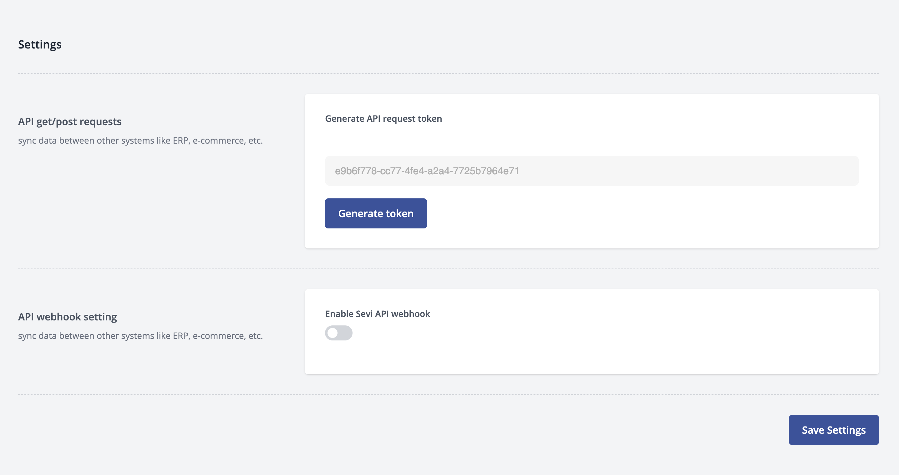

# Token

In the Settings View on admin.sevi.io, you can locate the API token that has been assigned to your account. This API token can be revoked if needed. To generate a new API token, simply click on the "Generate" button. If you already have an existing API token, you can create a new one after revoking the old one. This process ensures that your account is secure and that only authorized individuals have access to your API token. It is important to note that API tokens provide programmatic access to your account, so you should handle them with care and only share them with trusted parties.In the Settings View you of admin.sevi.io your can find the revokable API token for your account. Click on Generate to a new token or to create a new token after one is se

