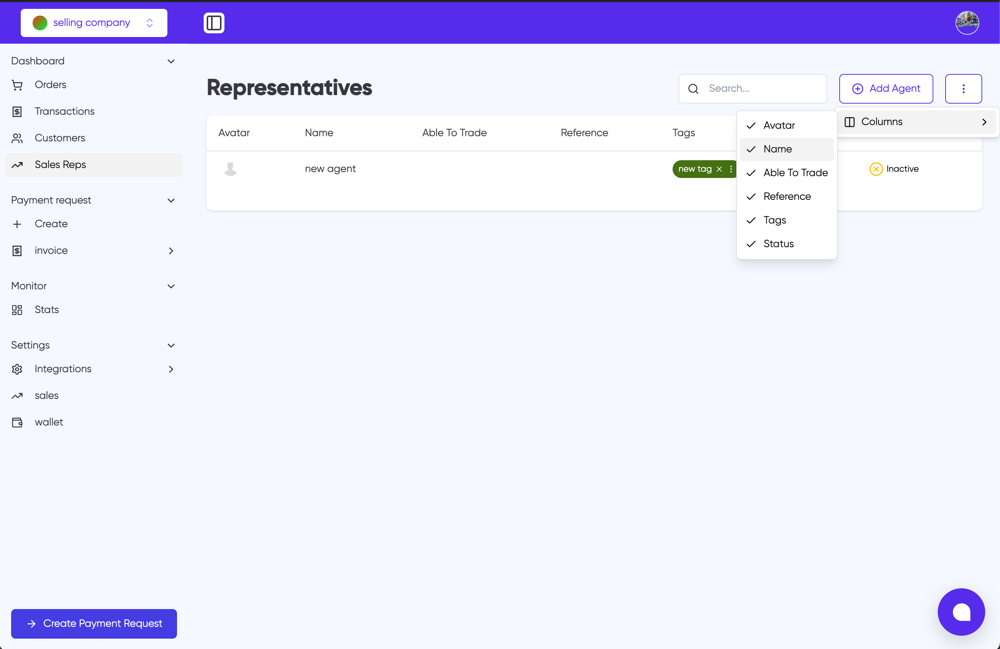

# Agent Management

Agents (also called Representatives) in the Sevi platform are responsible for managing orders and deliveries. They can set their own commission rates for each order.

## Adding New Agents

To set up a new agent under your account:

1. Click the "Add Agent" button in the Representatives section
2. Fill in the required agent details:
   - Name
   - Reference number
   - Contact information
3. Set the agent's status to "Verified" to activate their account
4. Assign relevant tags to the agent

Once verified, agents can access both the admin portal and mobile app to begin their work.

## Managing Agents

The Representatives dashboard allows you to:

- View all agents and their current status
- Track which agents are able to trade
- Manage agent tags
- Search for specific agents
- Customize visible columns including:
  - Avatar
  - Name
  - Able To Trade status
  - Reference number
  - Tags
  - Status

## Agent-Buyer Mapping

Use the tagging system to map agents to specific buyers:

1. Create appropriate tags for different regions, buyer groups, or categories
2. Assign these tags to agents
3. Link buyers to the same tags
4. Agents will then be able to service buyers with matching tags

This ensures efficient territory management and proper agent-buyer relationships.

:::tip
Make effective use of tags to organize your agent network and streamline order management.
:::
