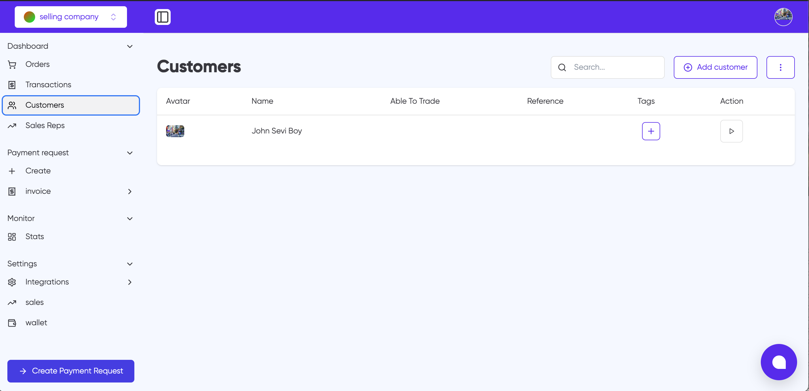

# Customers

The Customers page allows you to manage and view all your customer information in one place. This interface provides essential tools for customer relationship management.

## Key Features

### Search and Add Customers

- Use the search bar in the top-right to quickly find specific customers
- Click the "Add customer" button to create new customer profiles

### Customer List View

The customer list displays the following information in columns:

- **Avatar**: Customer's profile picture
- **Name**: Customer's full name
- **Able To Trade**: Trading status indicator
- **Reference**: Customer reference number
- **Tags**: Custom tags for customer categorization
- **Action**: Additional actions menu

### Customer Management

- Add tags to customers using the "+" button
- Access additional options through the action menu (⋮)
- View detailed customer information by clicking on a customer row

## Navigation

The Customers section can be accessed from the main navigation menu on the left side of the dashboard, under the main menu items.

## Related Features

- Customer data is integrated with the Orders and Transactions sections
- Customer information can be used when creating payment requests
- Customer profiles are linked to the sales management system
