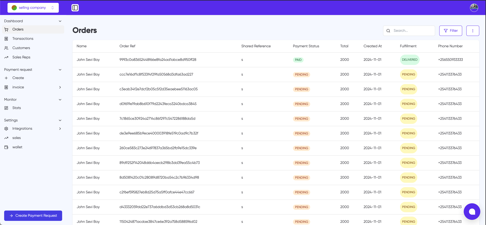

# Orders

The Orders page provides a comprehensive view of all customer orders in the system. This interface allows sellers to track and manage orders efficiently.

## Page Elements

### Search and Filter

- A search bar in the top-right corner allows quick lookup of orders
- A "Filter" button enables advanced filtering of orders

### Order Table

The main table displays key order information with the following columns:

1. **Name** - Customer's name
2. **Order Ref** - Unique order reference number
3. **Shared Reference** - Additional reference field (marked with 's')
4. **Payment Status** - Shows either:
   - PAID (green)
   - PENDING (orange)
5. **Total** - Order amount
6. **Created At** - Order creation date
7. **Fulfillment** - Order status:
   - DELIVERED (green)
   - PENDING (yellow)
8. **Phone Number** - Customer's contact number

### Actions

- A "Create Payment Request" button is available at the bottom of the page
- Additional options can be accessed through the menu (⋮) button in the top-right corner

## Navigation

The left sidebar provides quick access to related sections:

- Dashboard
- Orders
- Transactions
- Customers
- Sales Reps
- Payment Request
- Invoice
- Monitor
- Settings
