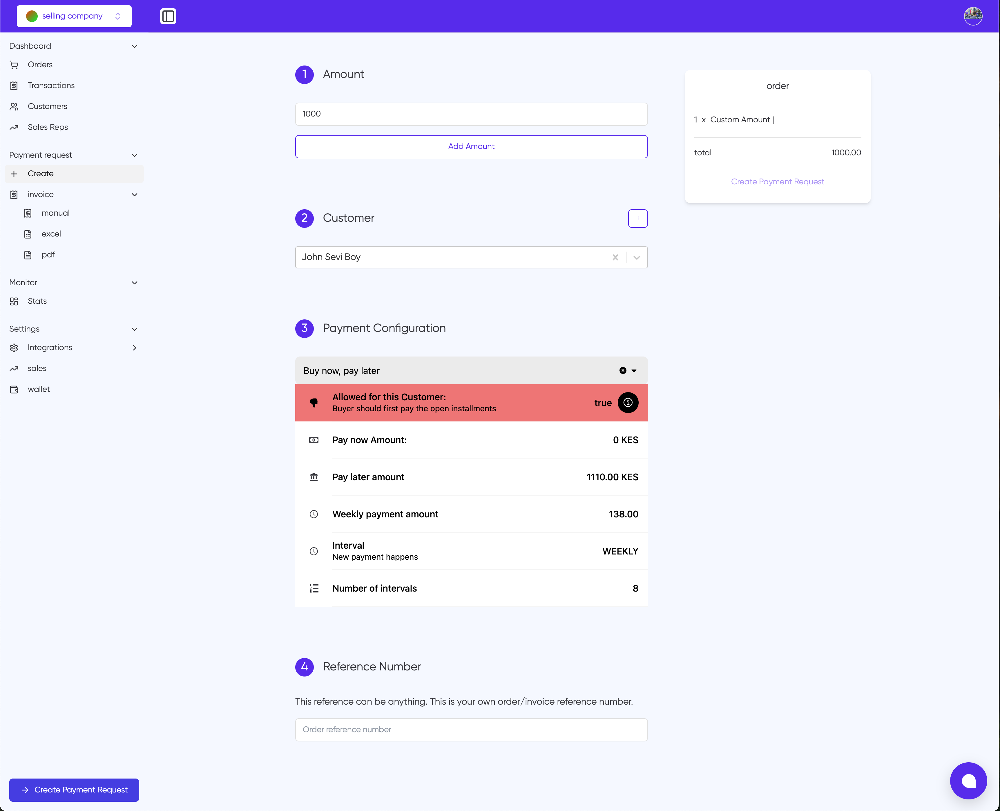

# Payment Request

The Payment Request page allows sellers to create and manage payment requests for customers. This page provides a comprehensive interface for setting up flexible payment terms and configurations.

## Key Components

### 1. Amount

- Enter the total amount for the payment request
- The system displays the amount in the order summary on the right
- Use the "Add Amount" button to confirm the entered value

### 2. Customer Selection

- Select a customer from the dropdown menu
- A "+" button is available to add new customers if needed
- The system will validate if the selected customer is eligible for payment terms

### 3. Payment Configuration

The payment configuration section allows you to set up "Buy now, pay later" terms:

#### Key Settings:

- **Customer Eligibility**: Shows if the selected customer is allowed to use payment terms
- **Pay Now Amount**: The upfront payment required (if any)
- **Pay Later Amount**: The total amount to be paid in installments
- **Weekly Payment Amount**: The calculated amount per installment
- **Payment Interval**: How often payments should be made (e.g., WEEKLY)
- **Number of Intervals**: Total number of installment periods

### 4. Reference Number

- Enter a unique reference number for the payment request
- This can be any value that helps you track the order/invoice
- The reference number is for your internal tracking purposes

## Creating a Payment Request

1. Enter the total amount
2. Select the customer
3. Review and adjust payment configuration if needed
4. Add a reference number
5. Click "Create Payment Request" at the bottom of the page

## Important Notes

- The system automatically calculates installment amounts based on the total sum and number of intervals
- Ensure the customer is eligible for payment terms before proceeding
- All amounts are displayed in KES (Kenyan Shillings)
- Weekly payment amounts are automatically calculated for even distribution across the payment period
