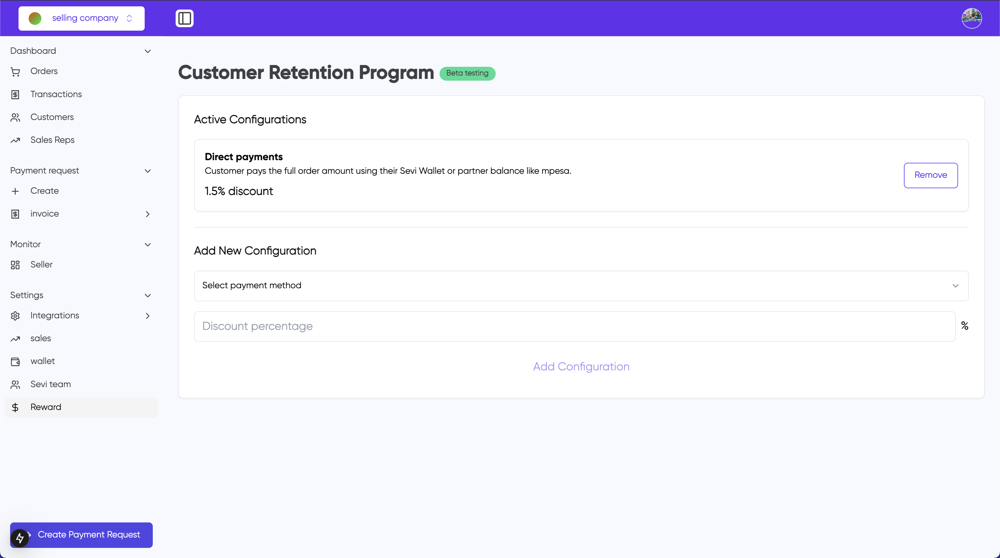

# Customer Retention program

This configuration enables a cashback program designed to engate customers such that they are insentived to reorder. The encouraging of repeated purchases at the seller happens via a point reward system. The program can be configured and promoted in multiple ways.

- Converts credit transaction fees into reward points that can be redeemed on subsequent orders only with you as a seller.
- Earn points on direct payments so that stimulates buyers to order again in the future.

## How It Works

### Fee Conversion to Rewards

- When a buyer places an order, a percentage of that order amount is allocated to be used on future orders.
- Example: On a ₱10,000 order with ₱220 in fees, the buyer receives ₱220 in reward points
- Reward points are seller-specific and can only be used with the original seller

### Reward Point Usage

- Reward points can be applied to the next eligible order or can be accumulated over multiple orders.
- Rewards are deducted from the final payment amount through the credit configuration system.

## Features

### For Sellers

- Customizable reward settings through the admin panel
- Tracking of accumulated reward points per customer
- Detailed reporting of reward point distribution and usage
- Integration with existing credit configuration system

### For Buyers

- Visible reward point balance in the mobile app
- Seller-specific reward points displayed in seller search
- Automatic application of rewards on eligible orders
- Total earned cashpoints tracking

## Implementation Details

### Order Processing

1. Original Order:

   - Order Value: ₱10,000
   - Transaction Fee: ₱220
   - Total Payment: ₱10,220
   - Reward Points Earned: ₱220
2. Subsequent Order with Rewards:

   - Order Value: ₱10,000
   - Transaction Fee: ₱220
   - Reward Points Applied: -₱220
   - Final Payment: ₱10,000

### Important Notes

- Reward points are seller-specific to encourage customer loyalty
- Transaction fees are calculated on the full order amount before reward point application
- Rewards are processed sequentially in the order they were earned
- The seller receives the full order amount minus the original transaction fees

## Benefits

- Zero effective transaction fees for buyers
- Increased customer loyalty through seller-specific rewards
- Enhanced value proposition for the Sevi platform
- Simplified reward tracking and redemption process
