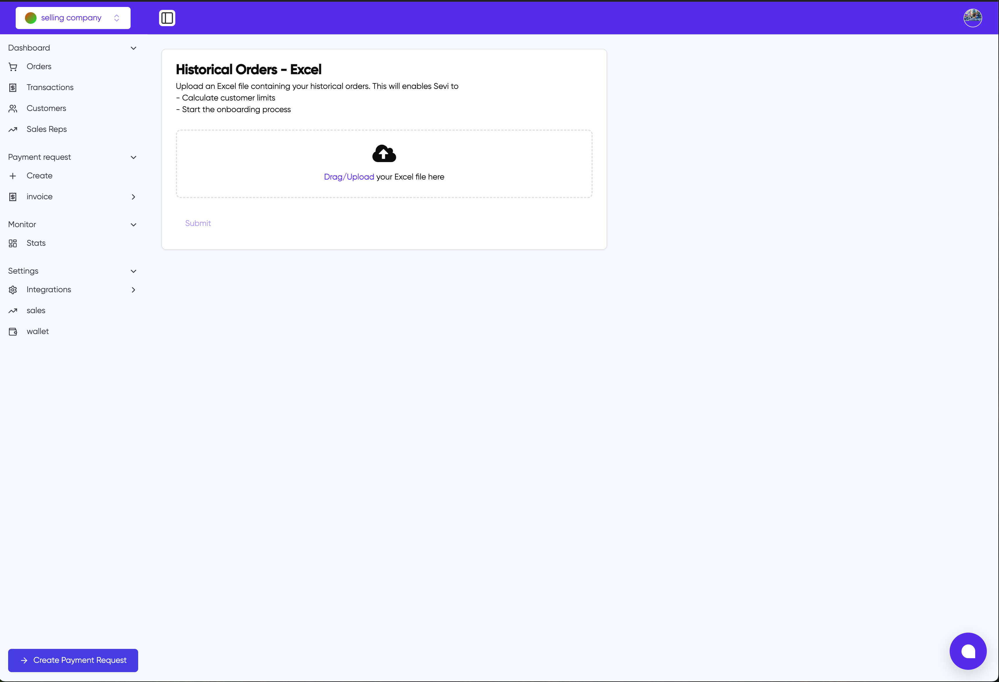

# Historical Sales Upload

The sales section allows you to upload historical sales data through an Excel file upload interface. This feature enables Sevi to calculate customer limits and initiate the onboarding process.

## Historical Orders - Excel Upload

You can upload your historical orders by following these steps:

1. Prepare an Excel file containing your historical order data
2. Either drag and drop your Excel file into the upload area or click to browse
3. The system will confirm your file selection (e.g., "Selected file: test.xlsx")

## Required Fields Mapping

After uploading your file, you'll need to map the Excel headers to the required system fields:

### Mandatory Fields (marked with *)

- **Name**: Customer's full name
- **Phone Number**: Customer's contact number
- **Amount**: Transaction amount
- **Date**: Transaction date
- **Reference**: Order reference number

### Optional Fields

- **Email**: Customer's email address
- **Company**: Customer's company name
- **Tags**: Any relevant tags or categories
- **Address**: Customer's physical address

## Field Mapping Process

1. For each field, select the corresponding column header from your Excel file using the dropdown menu
2. Ensure all mandatory fields (marked with *) are mapped
3. Optional fields can be left as "Unselect" if not applicable
4. Click the "Submit" button once all required mappings are complete

## Purpose

This data upload serves two main purposes:

- Calculate appropriate customer credit limits
- Initialize the customer onboarding process

> **Note**: Ensure your Excel file contains accurate and up-to-date information before uploading, as this data will be used for critical business decisions.
