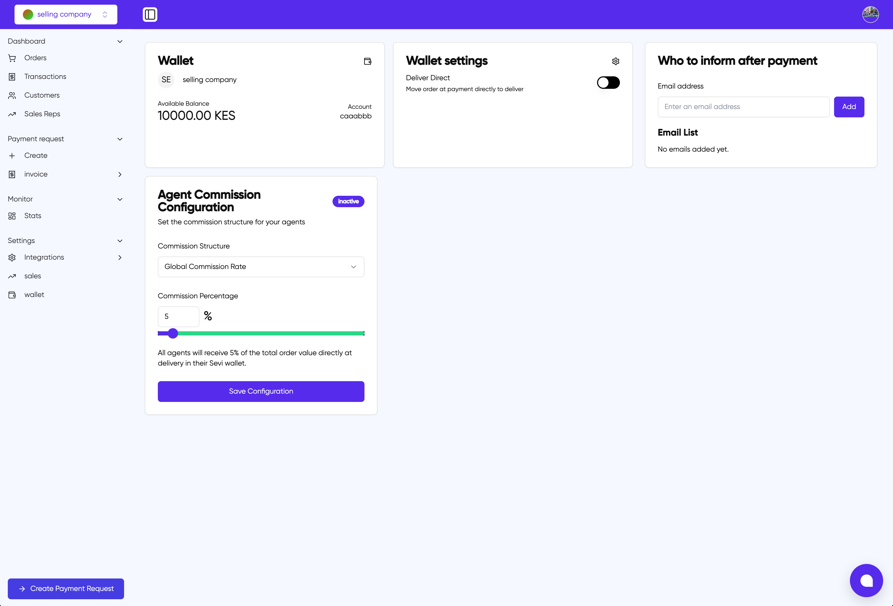

# Wallet Settings

The Wallet Settings page provides configuration options for managing your wallet and commission structures. This page consists of three main sections:

## 1. Wallet Overview

The wallet overview section displays:

- Your company identifier (SE)
- Company name
- Available balance in KES
- Account number

## 2. Wallet Settings

### Deliver Direct

Toggle this option to automatically move order payments directly to delivery. When enabled, payments will be processed immediately upon delivery confirmation.

## 3. Payment Notifications

### Who to inform after payment

Configure email notifications for payment events:

- Enter email addresses to receive payment notifications
- Add multiple email addresses to create a notification list
- All listed emails will be notified when payments are processed

## 4. Agent Commission Configuration

Configure commission structures for your sales agents:

### Commission Structure

- Select the Global Commission Rate
- Set Commission Percentage using the slider (currently set to 5%)
- Changes affect all agents uniformly
- Commissions are automatically credited to agents' Sevi wallets upon delivery

### Status

The commission configuration can be either:

- Active: Commission rules are currently in effect
- Inactive: Commission payments are suspended

### Save Configuration

Click "Save Configuration" to apply any changes to the commission structure.

**Note**: All commission payments are processed automatically and credited directly to agents' Sevi wallets upon successful delivery completion.
