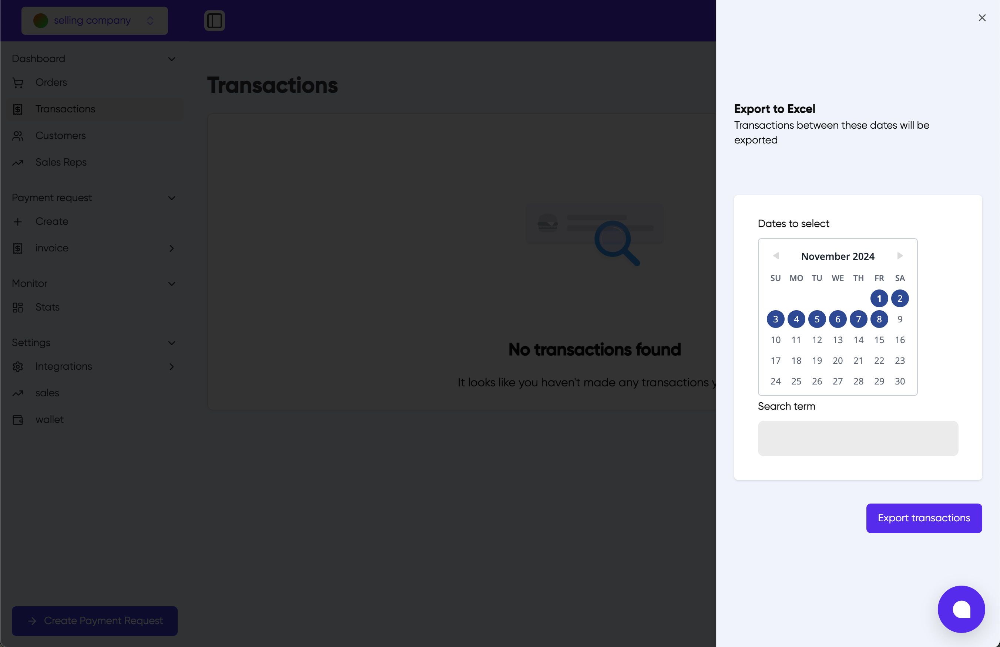

# Transactions

The Transactions page provides a comprehensive view of all financial transactions in your seller account. This section allows you to monitor, search, and export transaction data.

## Overview

The main transactions screen displays:

- A list of all transactions (when available)
- Search functionality
- Export capabilities
- Date filtering options

## Features

### Search Transactions

Use the search bar to filter transactions by specific terms or criteria. This helps you quickly locate particular transactions.

### Export to Excel

1. Click the "Export to Excel" button
2. Select the date range for the transactions you want to export
3. (Optional) Add search terms to filter the export
4. Click "Export transactions" to download the Excel file

### Date Selection

- Use the calendar interface to select specific dates or date ranges
- Navigate between months using the arrow buttons
- Click on dates to select them
- Selected dates will be highlighted in blue

### No Transactions State

If no transactions are found, you'll see a "No transactions found" message. This can occur if:

- You haven't processed any transactions yet
- No transactions match your current search criteria
- The selected date range contains no transactions

## Creating New Transactions

To initiate a new transaction, use the "Create Payment Request" button located at the bottom of the page.

## Related Features

- Orders
- Invoices
- Payment Requests
- Wallet
