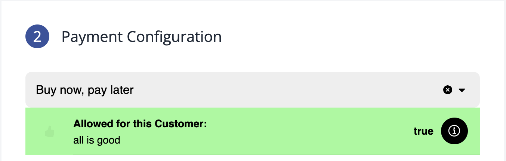

# Getting paid

In the below explenations we will guide you though the the different payment scenarios as a seller. 

##### Buyer no limit

When creating an order for a buyer, if the buyer has no available Sevi pay later limit, the amount will not be reserved. In this case, as a seller, you cannot be completely certain that you will receive payment upon delivery. The Admin protal will provide this information in a notification like >

#### **Buyer with limit**

However, if the buyer does have an available limit, that amount will be reserved until the order is marked as delivered or moved to the archived status. The order can be archived by the seller, an agent, or the buyer. on the admin portal it will show > 

##### **Delivery**

To ensure smooth delivery, it’s important that the buyer marks the order as delivered through either the USSD menu or the Sevi app. Once the order is marked as delivered, you the seller will  get a delivery code.  This code serves as proof of payment and can be shared with the driver or agent. Additionally, the agent can verify in the app that the order has been successfully paid.

##### Getting paid and Credit start

When the order is delivered the buyers credit will start and you the seller will instantly recieve the money.
